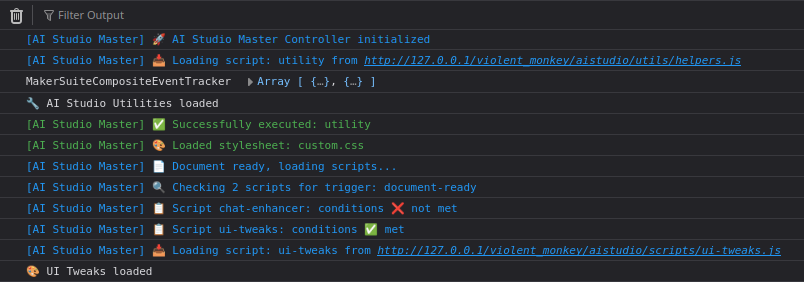
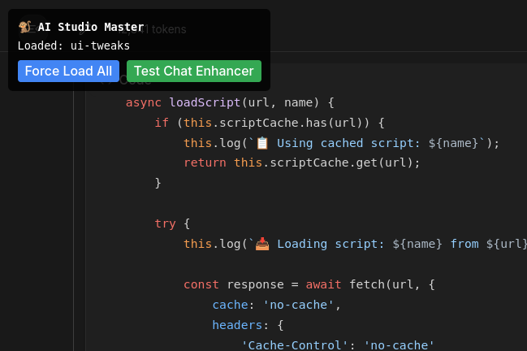
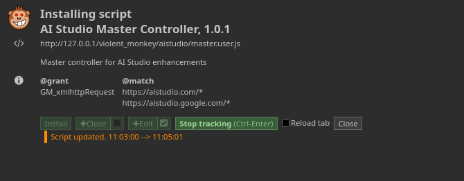
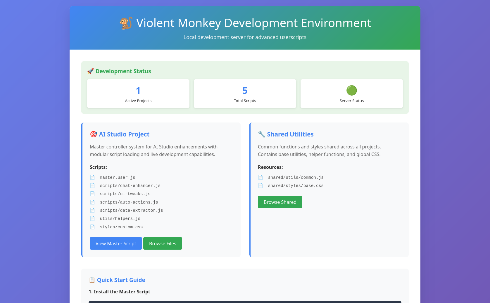

# Violent Monkey Tracking

### Console Log
Here's a demo of the terminal log in AiStudio, the master script is working and launching others.


### Website Interface


## External Tracking

To load the script I can visit the frontend
```
http://127.0.0.1/violent_monkey/
```
And then click "View Master", which opens 
```
http://127.0.0.1/violent_monkey/aistudio/master.user.js
```

#### Enable Tracking and keep the tab open, to catch live updates



#### Frontend


